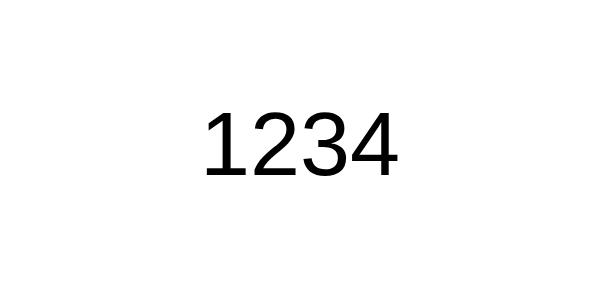

# Just four digits

No challenge here - the 4 digits to open the box are given as is. This is the first stage to help understand how the puzzle treat box works - look at the digits, manipulate the lock and enjoy the treat.

## Customization
- Font select - web safe fonts, comic Sans included!
- Font size. No "randomize" button - different
- Font color

## Implementation notes
- Since this is a 4-digit code, the default canvas size assumes horisontal orientation
- The code is in the middle of the image
- Maximum text font means text height matches canvas height
- The random color must be dark to be easily readable on white background
