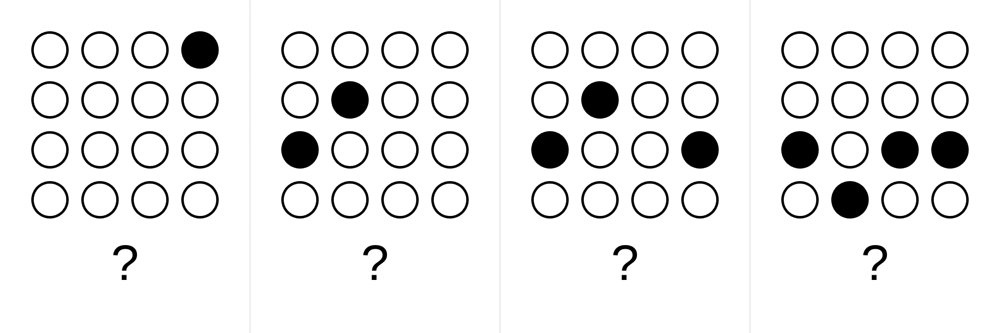

# Count circles – simple in grid

Simple counting-based challenge. Each digit is encoded with a grid of circles.
In the grid, each circle is either empty or filled.
Count the circles in every scene (left-to-right) to reveal the code.

### Implementation notes
- because each digit is from 0 to 9, the minimum cell size is chosen to be 3×3
- Underneath each grid, there is a question mark sign so that when you print the challenge and cut it out, the orientation is clear.
