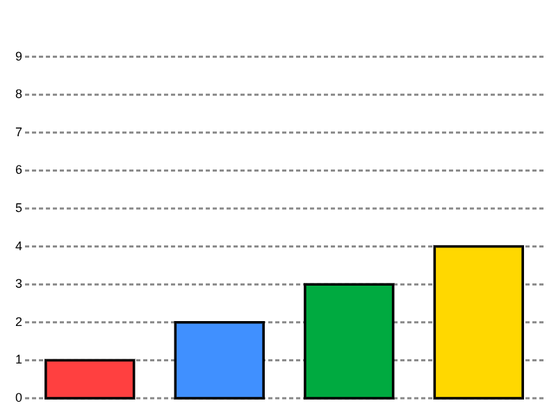

# Bar chart

Each digit is encoded as the height of a bar in a simple bar chart. Horizontal grid lines with numbers on the left make it easy to read the values.

### Implementation notes
- The digits 0–9 are only to the left of the chart, allowing to cut them (or some of them) out once the child gains enough experience.
