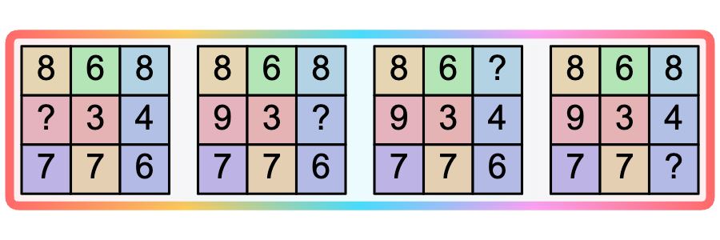

# Missing Digit Grid Match

Four identical grids of random digits are displayed side by side. In each grid, one cell is replaced with a "?" — a different cell in each grid. The solver reads the hidden digit from the matching position in the other three grids where it is still visible.

Optional color-coding gives each cell a unique background hue so the solver can quickly locate the same cell across grids.

