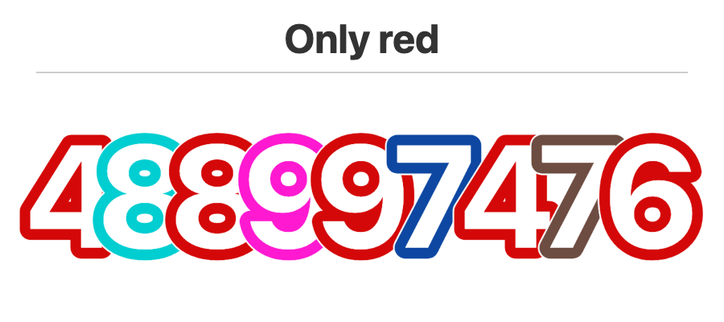

# Outlined Digits Filter

A row of digits with colored outlines is displayed along with a rule at the top. The child must identify which digits match the rule and read them left-to-right to get the code.

### Rule types
- **Color-based**: "Only red", "Only blue", etc. - pick digits with the specified outline color
- **Math-based**: "Only even", "Only odd", "Only less than 5", "Only 5 or more"

### Implementation notes
- Uses shared 10-color palette from `shared/colors.js`
- Code digits are automatically generated to match the selected rule
- Distractor digits are interleaved between code digits and never match the rule
- For color rules, distractors use any digit but with a different outline color
- For math rules, distractors use digits that don't satisfy the mathematical condition
