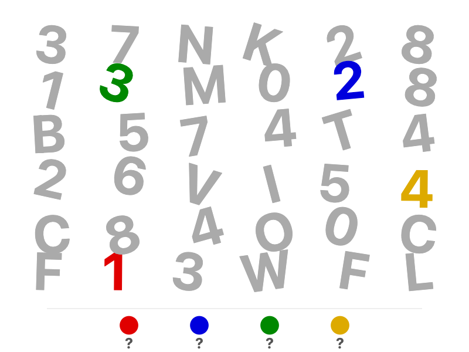

# Label Haystack

A canvas full of scattered single-digit numbers (and optionally letters) in varying rotations. Most are grey distractors. Each code digit appears exactly once in a unique bright color. At the bottom, colored circles with "?" prompt the solver to find the digit matching each color.

