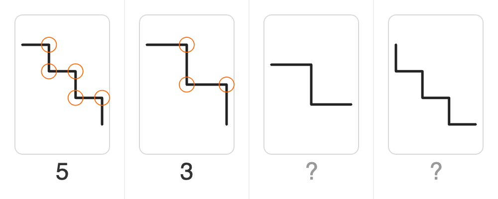

# Broken Line Digit (Corner-Count Polyline)

Each code digit is represented by a polyline (connected line segments) inside its own panel. The number of corners (direction changes) in the polyline equals the digit value — a straight line means 0, one bend means 1, and so on up to 9. A "?" sits below each panel for the solver to fill in.

