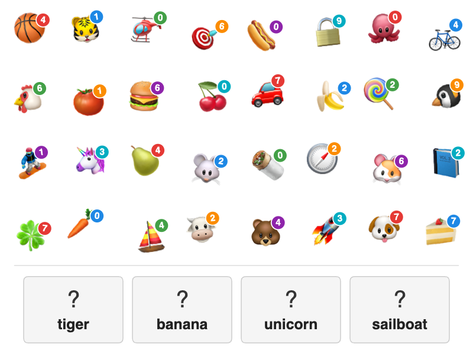

# Emoji Word Match

Emojis are scattered across the upper area of the canvas, each carrying a small colored badge with a digit. Distractor emojis with their own badges are mixed in. At the bottom, word boxes show the English (or Russian) name of each answer emoji next to a "?" — the solver finds the named emoji above and reads the digit from its badge.

