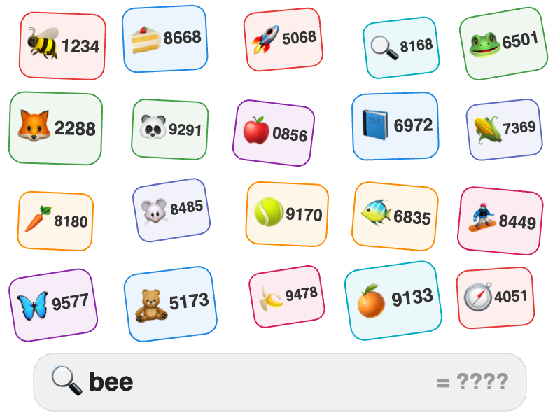

# Emoji Word Bubbles

Colored bubbles are arranged in a grid (or scattered / in a ring). Each bubble contains an emoji and a multi-digit number. A search-bar prompt at the bottom shows a target word (the name of one emoji) followed by "= ????" — the solver finds the bubble with that emoji and reads its number.

