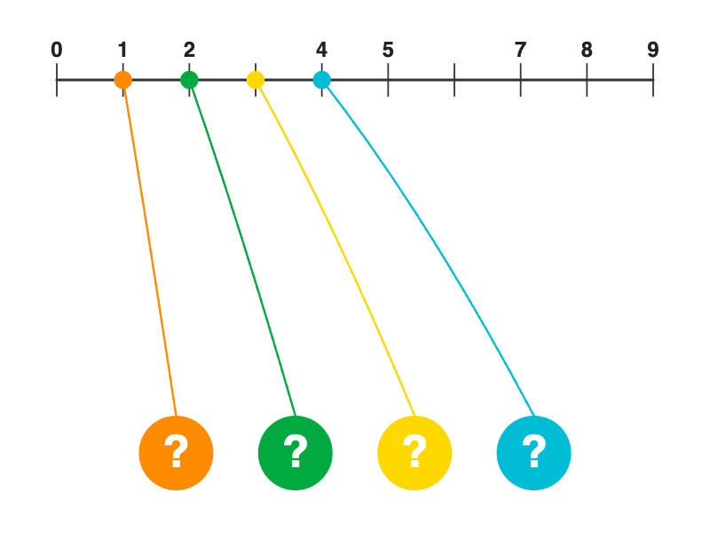

# Number Line Drop Lines

A 0–9 number line with colored dots and curved drop lines. Each line connects a "?" circle at the bottom to a position on the number line. Follow each colored line upward to read the digit it lands on. Left-to-right order of the "?" circles gives the code.

### Implementation notes
- A 10-position mask controls which numbers are visible on the line (use 0 to hide a number, adding difficulty)
- Colors are seeded-shuffled per code so each puzzle looks unique
- 5 palette options: bright, pastel, warm, cool, neon
