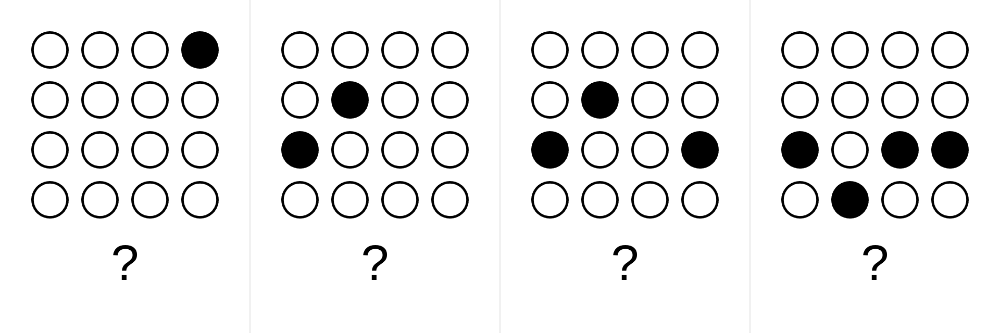

# Puzzle treat box challenges

[PuzzleTreatBox](https://www.puzzletreatbox.com/) is a sturdy industrial safe secured with a large digit padlock. Each day, a child solves a puzzle challenge to reveal the 4-digit code, open the box, and claim a small reward inside.

This repository contains js generators for these challenges.

## Generators
- Each generator allows creating and downloading an image on the canvas. The image encodes N digits (min 3, default 4, max 5).
- Minimal html/js code, no styles. Each puzzle in its directory is self-contained (shared resources are copy-pasted into the puzzle's html/js/dir).
- Canvas size (width and height) should be the first customization setting, set as two number inputs
- All other sizes, including margins, font size and line thickness, are relative: instead of fixed pixel the control should be range between 0 and some maximum value.
- Changing any input value re-renders the canvas for instant preview
- The code input has "🎲" button to the right of it to randomize the code and re-render instantly. The new random code should have the same amount of digits as before the randomization.
- Clicking the canvas downloads the .png image named like puzzle_name_XXXX, where XXXX is the code. It then changes the code to the random one and re-renders it.
- For range inputs, copy code from shared/js/display-values-next-to-range-inputs.js
- The README.md for each puzzle should only describe puzzle mechanics very concisely and with minimal markdown formatting, not including all the customization options. See 01_count_filled_circles_in_grid/README.md for an example

## Generator page layout
- Canvas size controls
- The code text input, filled with initial 4-digit code "1234"
- horizontal line
- Creativity controls to change some properties of the puzzle.
- "Restore defaults" button restores the parameters; "Re-render" button re-renders the canvas, so if any randomization is applied, the user gets the new randomized image on canvas.
- Canvas. White background (printer friendly), 1px grey border, cursor:pointer, title: click to download

## Examples

Click any image below to explore the generator and example output. All examples encode 1234.

# Puzzle guidelines
- Instant affordance: By visual inspection alone, it should be obvious what action to perform to extract each digit.
- Creative > academic: Should feel like a visual riddle or toy, not school math.
- Minimal or no text: Prefer zero text, unless the puzzle is explicitly reading-based. If unavoidable, use the absolute minimum and place it unobtrusively.
- Visual clarity: High contrast, clean shapes, no visual noise. Readable when printed.
- Color-friendly: Designed for color printing; colors must be distinguishable and meaningful.
- Unambiguous digits: Each digit must decode to exactly one value—no alternative interpretations.
- Scales with N: Works equally well for 3–5 digits without redesigning the core idea.
- Child-solvable, adult-pleasant: Easy to solve, satisfying to look at.
- Failure-proof: No edge cases where a digit could be misread due to layout, overlap, or ambiguity.
- Generator-friendly: Rules should be trivial to parameterize and randomize in code.

Think [ARC AGI](https://arcprize.org/arc-agi) but benchmarking kids 😉
